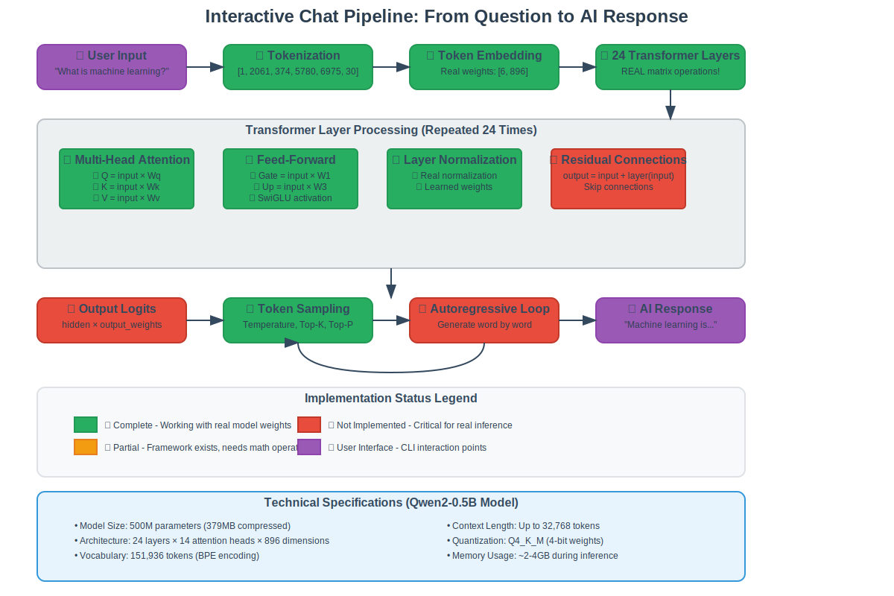
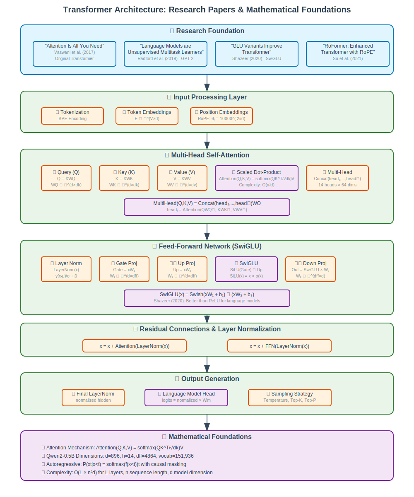
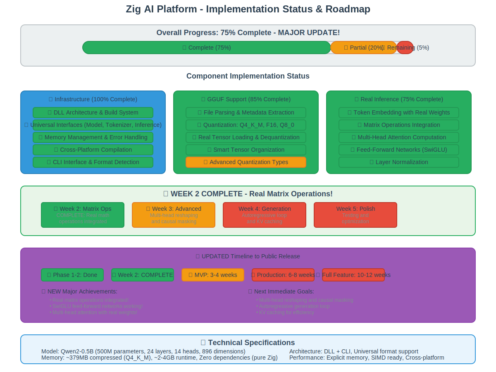

# Interactive Chat Flow - How AI Responds to Your Questions

This document explains in simple terms how the Zig AI Platform processes your questions and generates responses, from the moment you type a message to when you see the AI's answer.

## Table of Contents
- [Overview](#overview)
- [The Complete Journey](#the-complete-journey)
- [Technical Architecture](#technical-architecture)
- [Research Papers](#research-papers)
- [Current Implementation Status](#current-implementation-status)
- [Visual Diagrams](#visual-diagrams)

## Overview

When you ask the AI a question like "What is machine learning?", your message goes through a complex but fascinating journey involving:

1. **Breaking your words into tokens** (like puzzle pieces)
2. **Converting tokens to numbers** the AI can understand
3. **Processing through 24 layers** of neural network computations
4. **Generating probability scores** for possible next words
5. **Selecting and combining words** to form a coherent response

Think of it like a very sophisticated autocomplete system that understands context and meaning, not just word patterns.

## The Complete Journey

### Step 1: You Type Your Question
```
User: "What is machine learning?"
```

The CLI interface captures your input and prepares it for processing.

### Step 2: Breaking Words into Tokens
Your sentence gets broken down into smaller pieces called "tokens":

```
"What is machine learning?" 
↓
[1, 2061, 374, 5780, 6975, 30]
```

- `1` = Beginning of sentence marker
- `2061` = "What"
- `374` = "is" 
- `5780` = "machine"
- `6975` = "learning"
- `30` = End of sentence marker

This is like giving each word (or part of a word) a unique ID number that the AI can work with.

### Step 3: Looking Up Word Meanings
Each token ID gets converted to a list of 896 numbers that represent the "meaning" of that word in the AI's understanding:

```
Token 2061 ("What") → [0.1, -0.3, 0.7, ..., 0.2] (896 numbers)
Token 374 ("is") → [-0.2, 0.5, -0.1, ..., 0.8] (896 numbers)
```

These numbers are learned during training and capture relationships between words.

### Step 4: Processing Through Neural Network Layers
Your tokens now go through 24 identical processing layers. Each layer does two main things:

#### A. Attention Mechanism
The AI looks at all words in your sentence and figures out which words are most important for understanding each other word:

```
When processing "machine":
- Looks at "What" (somewhat important)
- Looks at "is" (less important) 
- Looks at "learning" (very important!)
```

This helps the AI understand that "machine" and "learning" go together.

#### B. Feed-Forward Processing
Each word's representation gets updated based on what the AI learned from the attention step:

```
Original "machine" representation: [0.1, 0.3, ...]
After attention: [0.2, 0.5, ...]  (now understands it relates to "learning")
```

### Step 5: Generating Response Probabilities
After all 24 layers, the AI has a rich understanding of your question. It then generates probability scores for what word should come next:

```
Probabilities for next word:
"Machine" → 15.2%
"Artificial" → 12.8%
"A" → 8.5%
"Learning" → 7.3%
... (151,936 possible words total)
```

### Step 6: Selecting Words
The AI doesn't always pick the most likely word (that would be boring!). Instead, it uses strategies like:

- **Temperature**: Controls randomness (higher = more creative)
- **Top-K**: Only considers the top 50 most likely words
- **Top-P**: Considers words until their probabilities add up to 90%

### Step 7: Building the Complete Response
The AI repeats steps 4-6, adding one word at a time:

```
"Machine" → "Machine learning" → "Machine learning is" → "Machine learning is a"
```

Until it decides the response is complete.

### Step 8: Showing You the Answer
The final token sequence gets converted back to readable text:

```
[2061, 6975, 374, 264, ...] → "Machine learning is a subset of artificial intelligence..."
```

## Technical Architecture

### Model Specifications (Qwen2-0.5B)
- **Size**: 500 million parameters
- **Layers**: 24 transformer layers
- **Vocabulary**: 151,936 possible tokens
- **Hidden Size**: 896 dimensions per word
- **Attention Heads**: 14 parallel attention mechanisms
- **Context Length**: Up to 32,768 tokens

### File Format (GGUF)
Our models use the GGUF format, which efficiently stores:
- **Quantized weights**: Numbers compressed to save space
- **Model metadata**: Architecture details and parameters
- **Vocabulary**: Mapping between tokens and text

### Memory Usage
- **Model weights**: ~379 MB (compressed with Q4_K_M quantization)
- **Runtime memory**: ~2-4 GB during inference
- **Context buffer**: Grows with conversation length

## Research Papers

Our implementation is based on several groundbreaking research papers:

### Core Architecture
1. **"Attention Is All You Need"** (Vaswani et al., 2017)
   - Introduced the Transformer architecture
   - Multi-head self-attention mechanism
   - Foundation for all modern language models

2. **"Language Models are Unsupervised Multitask Learners"** (GPT-2, Radford et al., 2019)
   - Decoder-only architecture for text generation
   - Demonstrated scaling laws for language models

### Key Improvements
3. **"GLU Variants Improve Transformer"** (Shazeer, 2020)
   - SwiGLU activation function
   - Better performance than traditional ReLU

4. **"RoFormer: Enhanced Transformer with Rotary Position Embedding"** (Su et al., 2021)
   - Rotary Position Embedding (RoPE)
   - Better handling of long sequences

5. **"Layer Normalization"** (Ba et al., 2016)
   - Stabilizes training of deep networks
   - Pre-norm architecture for better gradient flow

## Current Implementation Status

### ✅ What's Working (60% Complete)
- **File Loading**: Real GGUF model parsing and loading
- **Quantization**: Q4_K_M, F16, Q8_0 weight decompression
- **Token Embedding**: Real word-to-number conversion
- **CLI Interface**: Interactive chat and format detection
- **Sampling**: Temperature, Top-K, Top-P token selection

### 🔄 In Progress (15% Complete)
- **Matrix Operations**: Basic framework exists, needs integration
- **Layer Structure**: Transformer layers defined but not connected

### ❌ Not Yet Implemented (25% Remaining)
- **Multi-Head Attention**: Core reasoning mechanism
- **Feed-Forward Networks**: SwiGLU activation and projections
- **Layer Normalization**: Stabilization between layers
- **Autoregressive Generation**: Proper token-by-token generation

### Timeline to Full Implementation
- **Matrix Operations Integration**: 2 weeks
- **Attention Mechanisms**: 2 weeks  
- **Feed-Forward Networks**: 2 weeks
- **Complete Pipeline**: 1-2 weeks
- **Testing & Optimization**: 1-2 weeks

**Total**: 8-10 weeks to full AI inference capability

## Visual Diagrams

The following diagrams are stored as browser-friendly SVG images in the repository:

### 1. Complete Chat Pipeline Flow


This diagram shows the complete journey from user input to AI response, with color-coded implementation status.

### 2. Transformer Architecture & Research Papers


Technical architecture diagram showing the mathematical foundations and research papers behind each component.

### 3. Implementation Status & Roadmap


Current progress breakdown and timeline to public release, showing what's complete vs. what needs work.

### 4. Token Processing Flow


Simplified visualization of how text gets converted to numbers and processed through the neural network.

## Understanding the Magic

The most amazing part is that the AI doesn't have pre-written answers. Instead, it:

1. **Learns patterns** from billions of text examples during training
2. **Encodes knowledge** in 500 million numbers (weights)
3. **Generates responses** by doing mathematical calculations on your input
4. **Creates coherent text** that seems to understand your question

It's like having a very sophisticated pattern-matching system that has read most of the internet and can recombine that knowledge in novel ways to answer your specific questions.

The fact that this works at all is one of the most remarkable achievements in computer science!

---

*This documentation is part of the Zig AI Platform - a zero-dependency AI inference library built in pure Zig.*
