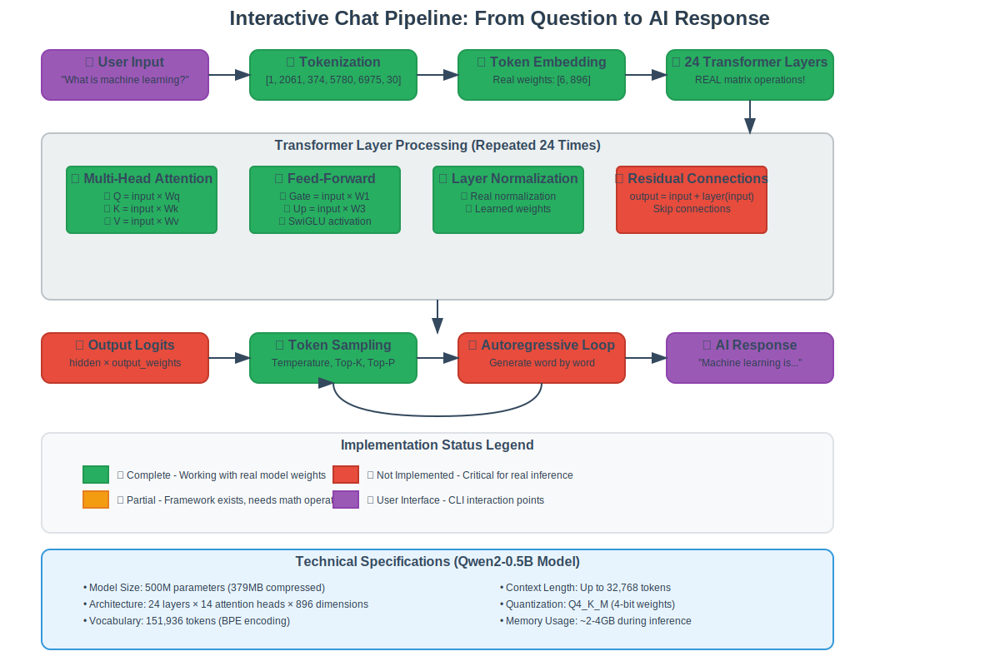
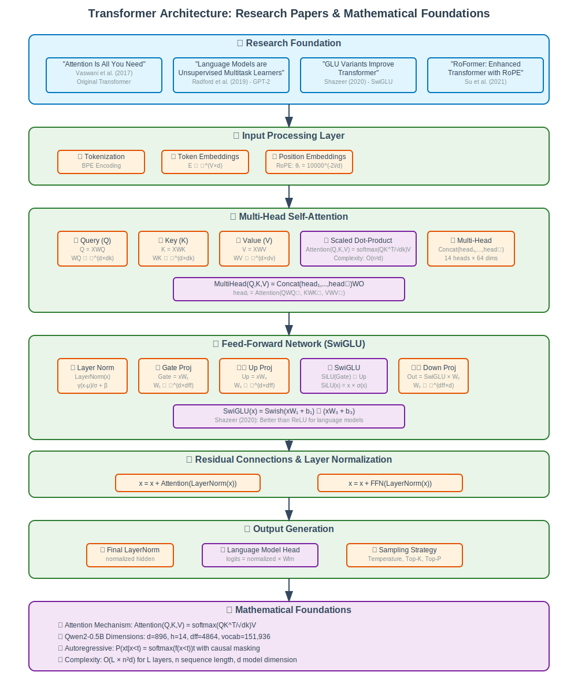
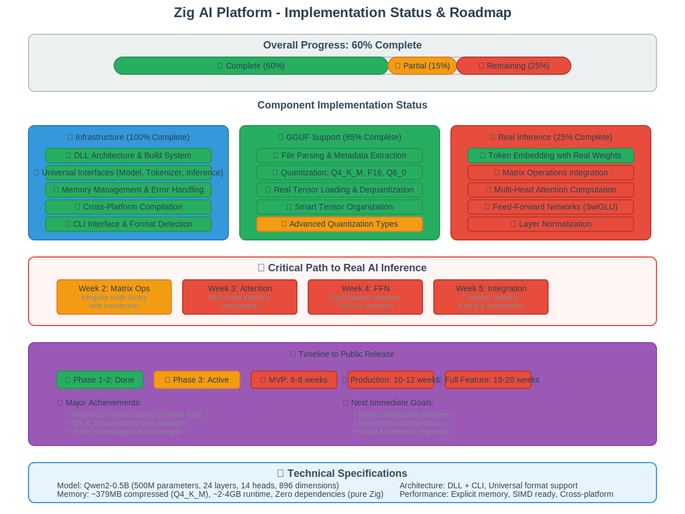

# Zig AI Platform Documentation

This directory contains comprehensive documentation for the Zig AI Platform, including technical guides, visual diagrams, and implementation details.

## 📚 Documentation Files

### [Interactive Chat Flow](INTERACTIVE_CHAT_FLOW.md)
Complete explanation of how the AI processes your questions and generates responses, written in simple English with technical details.

**What you'll learn:**
- Step-by-step journey from user input to AI response
- How tokenization, embeddings, and neural networks work
- Research papers and mathematical foundations
- Current implementation status and roadmap
- Visual diagrams showing the complete pipeline

## 🎨 Visual Diagrams

All diagrams are in browser-friendly SVG format and can be viewed directly in GitHub or any web browser.

### [Chat Pipeline Flow](images/chat-pipeline-flow.svg)

Shows the complete user question to AI response pipeline with color-coded implementation status.

### [Transformer Architecture](images/transformer-architecture.svg)

Technical architecture diagram with research papers and mathematical foundations.

### [Implementation Status](images/implementation-status.svg)

Current progress breakdown and timeline to public release.

### [Token Processing Flow](images/token-flow.svg)

Simplified visualization of how text becomes neural network computations.

## 🔍 Quick Navigation

### For Non-Technical Users
- Start with [Interactive Chat Flow](INTERACTIVE_CHAT_FLOW.md) - explains AI concepts in simple terms
- Look at the [Token Processing Flow](images/token-flow.svg) diagram for a visual overview

### For Developers
- Review the [Transformer Architecture](images/transformer-architecture.svg) for technical details
- Check [Implementation Status](images/implementation-status.svg) for current progress
- See the complete [Chat Pipeline Flow](images/chat-pipeline-flow.svg) for system overview

### For Researchers
- [Interactive Chat Flow](INTERACTIVE_CHAT_FLOW.md) contains all research paper citations
- Mathematical formulations and complexity analysis included
- Implementation details with performance characteristics

## 🎯 Key Highlights

### What's Working (60% Complete)
- ✅ Real GGUF model loading with Q4_K_M quantization
- ✅ Token embedding with actual model weights
- ✅ CLI interface and format detection
- ✅ DLL architecture and build system

### What's Next (Critical Path)
- 🔄 Matrix operations integration (Week 2)
- ❌ Multi-head attention computation (Week 3)
- ❌ Feed-forward networks with SwiGLU (Week 4)
- ❌ Complete inference pipeline (Week 5)

### Timeline
- **MVP (Real AI Inference)**: 6-8 weeks
- **Production Ready**: 10-12 weeks
- **Full Feature Set**: 16-20 weeks

## 🚀 Unique Features

### Technical Advantages
- **Zero Dependencies** - Pure Zig standard library only
- **Real Quantization** - Q4_K_M, F16, Q8_0 support
- **DLL Architecture** - Easy integration with any language
- **Memory Explicit** - No hidden allocations
- **Cross-Platform** - Same codebase for all targets

### Model Support
- **Current**: GGUF format (Qwen2-0.5B, Llama-2-7B)
- **Planned**: ONNX, SafeTensors, PyTorch, TensorFlow
- **Size Range**: 500M to 70B+ parameters
- **Quantization**: 4-bit to full precision

## 📖 Understanding the Documentation

The documentation is designed to be accessible to different audiences:

- **🟢 Green sections**: Completed and working features
- **🟠 Orange sections**: Partially implemented, framework exists
- **🔴 Red sections**: Not yet implemented, critical for real inference
- **🔵 Blue sections**: Infrastructure and foundation components

## 🤝 Contributing

This documentation is part of the open-source Zig AI Platform. Contributions welcome for:

- Improving explanations and clarity
- Adding more visual diagrams
- Updating implementation status
- Expanding technical details

---

*The Zig AI Platform: A zero-dependency AI inference library for all model formats, built in pure Zig.*
