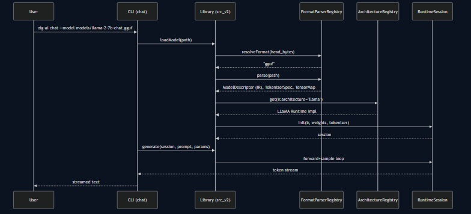
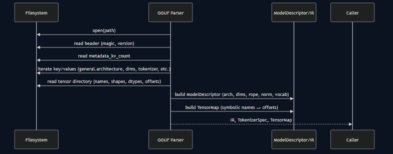
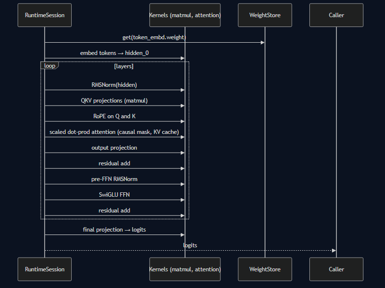

## Sequence Diagrams (Static Images)

Below images are exported from Mermaid to SVG for maximum Markdown compatibility. Mermaid source files are under src_v2/project-plan/images/src/.

### User Flow: CLI Chat

### Technical Parsing Flow

### Runtime Execution Flow (LLaMA)

---

Regeneration
- Requires mermaid-cli: `npm i -g @mermaid-js/mermaid-cli` (or npx)
- Commands:
  - `npx @mermaid-js/mermaid-cli -i src_v2/project-plan/images/src/cli-user-flow.mmd -o src_v2/project-plan/images/cli-user-flow.png`
  - `npx @mermaid-js/mermaid-cli -i src_v2/project-plan/images/src/parsing-flow.mmd -o src_v2/project-plan/images/parsing-flow.png`
  - `npx @mermaid-js/mermaid-cli -i src_v2/project-plan/images/src/runtime-execution-llama.mmd -o src_v2/project-plan/images/runtime-execution-llama.png`

Note: If SVG is not allowed in your renderer, replace .svg with .png in the -o path and update links above.
